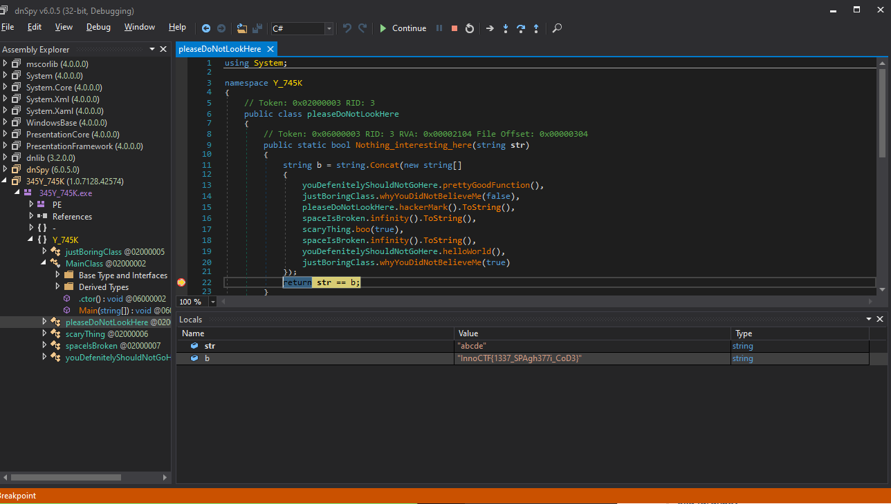

## Quick Peek writeup

#### Description

We were given an executable to traverse in order to find the flag.

#### Solution

I discovered that this was a .NET executable, so I used [dnSpy](https://github.com/0xd4d/dnSpy) to run the executable with debugging.

`InnoCTF{1337_SPAgh377i_CoD3}`
