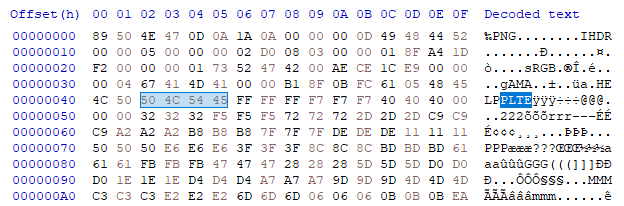
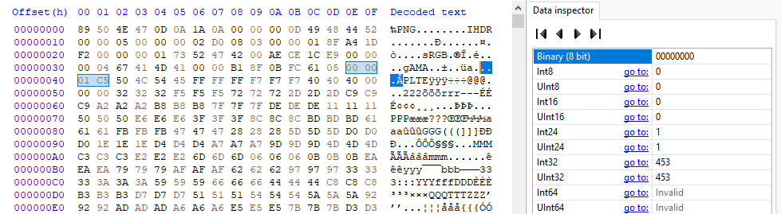
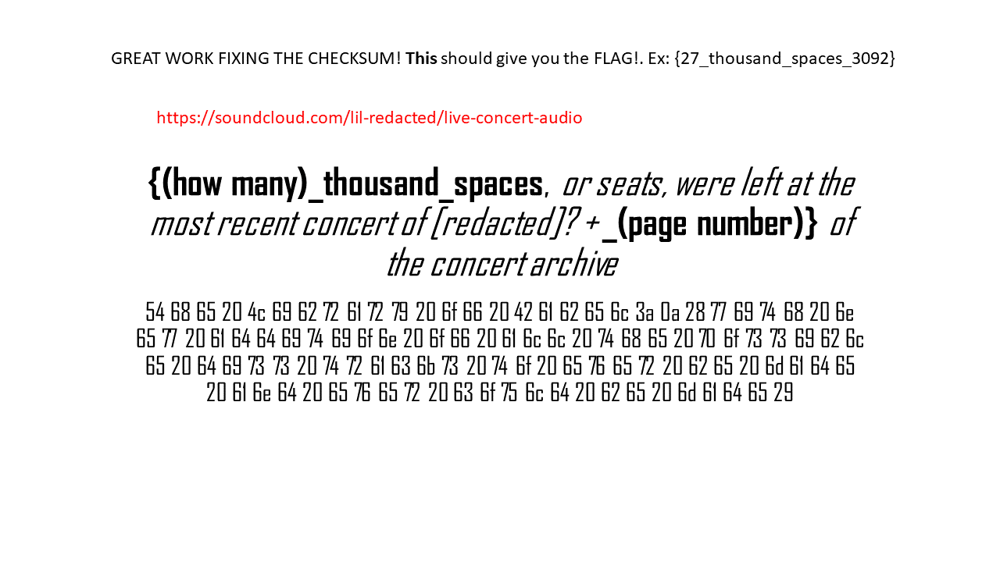

# Song of My People

## Description

A specific soundcloud rapper needs help getting into his password protected zipped file directory. The initial password is in the title. You just have to know your memes, and pick the right instrument! We were on the fence on giving you an image to go along with this puzzle, but the loincloth was too scandalous. Alternatively, you could bruteforce.

## Solution

The start of the challenge is a password protected zip file. The challenge description lead me to [The Song of My People! meme](https://knowyourmeme.com/memes/the-song-of-my-people) and to pick the right instrument which is `violin`.

The contents of the zip file were:

* `a lengthy issue.png`
  * This is a broken PNG image
* `Ice Cube - Check Yo Self Remix (Clean).mp3`
  * You better check yo self before you wreck yo self
* `README.txt`
    > one of the three files is a red herring, but a helpful one at that.
    >
    > does any of this ADD up? This is a LONG problem.

### a lengthy issue.png
Running `pngcheck` on the broken png file:
```
File: a lengthy issue.png (44525 bytes)
  chunk IHDR at offset 0x0000c, length 13
    1280 x 720 image, 8-bit palette, interlaced
  chunk sRGB at offset 0x00025, length 1
    rendering intent = perceptual
  chunk gAMA at offset 0x00032, length 4: 0.45455
  chunk PLTE at offset 0x00042, length 1212501072:  invalid number of entries (4.04167+08)
```

Opening `a lengthy issue.png` in HxD and finding the `PLTE` chunk:



Looking at the [libpng spec](http://www.libpng.org/pub/png/spec/1.2/PNG-Structure.html#Chunk-layout) and a [similar writeup](https://github.com/ctfs/write-ups-2015/tree/master/plaidctf-2015/forensics/png-uncorrupt). I figured out that the `HELP` text before the `PLTE` was the 4-byte length for the `PLTE` chunk.

Using the HxD data inspector I edited these 4 bytes to be the value of 453 in big-endian. The value for the PLTE header was the number of bytes between the end of PLTE and the beginning of the CRC for PLTE. The length also must be divisible by 3 for the PLTE chunk.



The fixed image:



### Image hex

The hex in the image:
```
54 68 65 20 4c 69 62 72 61 72 79 20 6f 66 20 42 61 62 65 6c 3a 0a 28 77 69 74 68 20 6e
65 77 20 61 64 64 69 74 69 6f 6e 20 6f 66 20 61 6c 6c 20 74 68 65 20 70 6f 73 73 69 62 6c
65 20 64 69 73 73 20 74 72 61 63 6b 73 20 74 6f 20 65 76 65 72 20 62 65 20 6d 61 64 65
20 61 6e 64 20 65 76 65 72 20 63 6f 75 6c 64 20 62 65 20 6d 61 64 65 29
```

Decoding this to ascii results in:
> The Library of Babel: (with new addition of all the possible diss tracks to ever be made and ever could be made)

### Soundcloud

[Link to soundcloud](https://soundcloud.com/lil-redacted/live-concert-audio)

Soundcloud description:

>this concert is part of a larger tour that is archived completely in some kind of hexagonal library. The archive is named between "maybe" and a "repeat". Should be on the 371st page.
>
> I would give you an mp3 of this audio, but I don't know how to navigate those sketchy websites.

The soundcloud "song" sounded like Morse code, after downloading the mp3 I discovered a [Morse code audio decoder](https://morsecode.scphillips.com/labs/audio-decoder-adaptive/).

The decoded text:
> SUP YALL ITS YA BOI LIL ICE CUBE MELTING OUT HERE IN THE HAWAII HEAT FOR ALL OF YOU. YOU GUESSED IT THIS IS LIVE AUDIO FROM MY WORLD TOUR. I REPEAT LIL ICE CUBES WORLD TOUR MAYBE A LIBRARY WILL HELP

### Library of Babel

With the hint of [Library of Babel](https://libraryofbabel.info) I tried inputting the hex from the image as the `Hex Name` but that ended up being a dead end. I tried using the search for `lil ice cubes world tour`:

```
exact match:
Title: weif.rfgkd,zvjxxd Page: 371
Location: 2nhptm68h2sputfsdlbmi75s6qcfgu...-w2-s4-v08
```

Nice! The page number matches the soundcloud description.

I downloaded the [book](https://libraryofbabel.info/bookmark.cgi?weif.rfgkd,zvjxxd371:1) and counted the number of spaces in the book (48558). I tried the flag `{48_thousand_spaces_371}` but it was incorrect. The image said thousand_spaces or seats, so I searched how many times the word `seat` appears in book (3). 

The final flag was `{3_thousand_spaces_371}`
