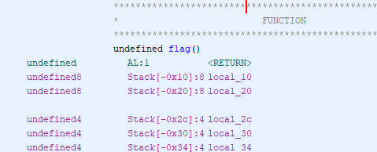
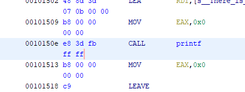
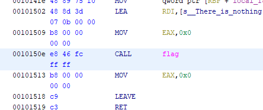

## Call Me writeup

#### Description

We were given a binary with no other clues to traverse to locate the flag.

#### Solution

Using [Ghidra](https://ghidra-sre.org/) I replaced the existing printf function in main to point to `void flag()` address instead.

* Import the file as Raw Binary (this is because Ghidra messes up the ELF header if imported as a ELF binary)
* Find the memory address of the flag function

* Find the main function

* Right click on the printf function and select patch instruction
* Change the call address to be the address of the flag function

* Export Program from Ghidra
* Run the executable

`InnoCTF{How_d1d_y0u_f1nd_m3_7f1bc88}`