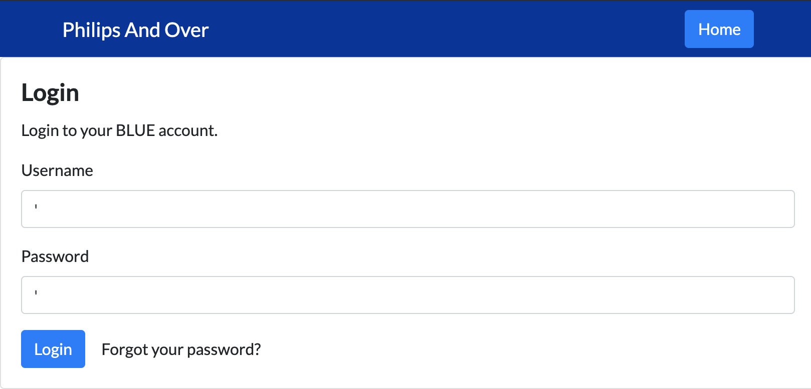
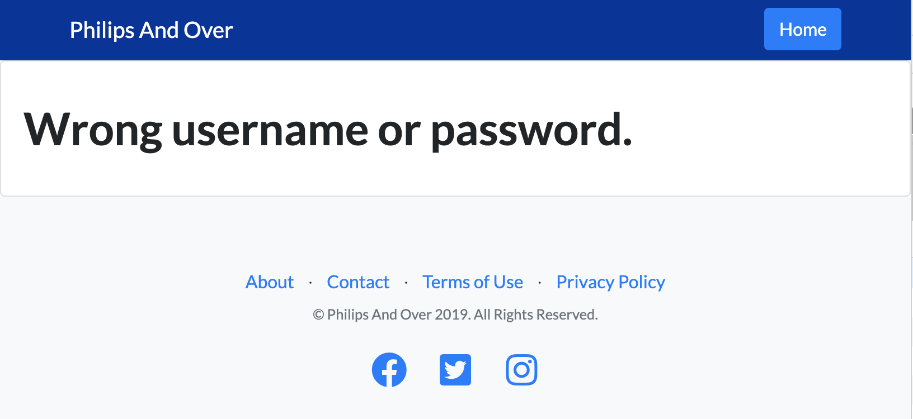
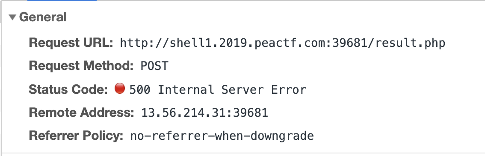
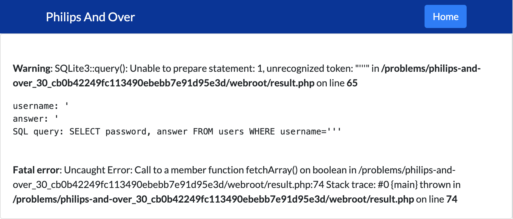
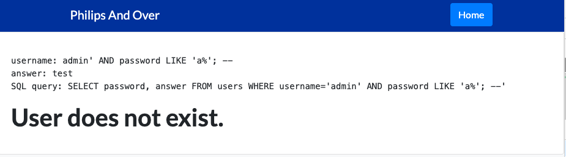
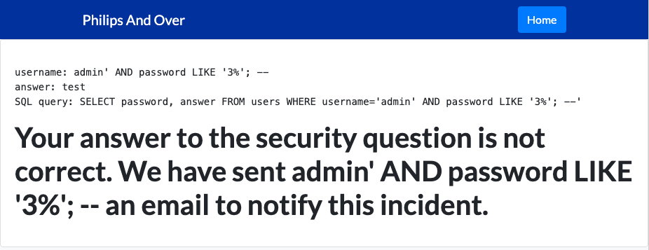

# Philips And Over

## Description

There is a website running at http://shell1.2019.peactf.com:39681. Try to log in the "admin" account.

## Observations

When I first loaded up the site, I saw that it was a site for a fake university. I started mapping out where the input fields are in the application so that I can see where user data gets sent to the server. The two inputs on the main page don't submit to anywhere, so I wouldn't be able to get far with those. So, I head to the Login form.

To check if the username and password fields might be vulnerable to SQL injection, I enter a single quote in each of the text fields.



I click login and I get this message



Nothing suspicious there. Next I head to the password reset form by clicking on "Forgot your password?"

For this form, I try the same thing, but this time I get a blank page, and when I look at the network request in my browser console, I can see that the server returned a 500 error.



This could mean that the application is vulnerable to SQL injection. I also notice that there's a `debug` attribute in the POST payload that is set to `0`.

So, I intercept the request with a [Burp](https://portswigger.net/burp) proxy and change `debug` to `1`, and get this as a response



Awesome! Looks like I broke the SQL query by adding an unmatched single quote. This means that I can manipulate this query with my input.

The only problem is that the result of my new query isn't returned in the server response. This means that I'll have to get the data that I want by guessing and checking to see if the query returns true or not.

## Solution

To figure out what the admin password is, I can send a `username` input like this

```
admin' AND password LIKE 'a%'; --
```

and I can see that the query returned false, because I see the message below



This means that the admin password doesn't start with `a`. I can keep changing the first character to brute-force the password until I see a message like this



If I keep brute-forcing the password in this manner until I get the entire thing, I end up with

```
39935951
```

as the admin password.

If I use that password to log in as `admin`, I can see the flag.

```
flag{peactf_E_>_A_64f5d6558fa180951f33eee07b48856f}
```
