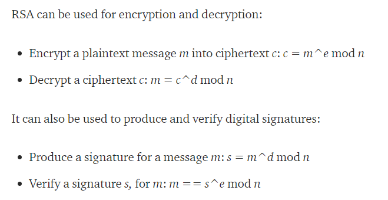

# RSA

## Description

Can you help Bob retrieve the two messages for a flag?

## Solution

The challenge included two files:

`auth_channel.txt`
```
Authenticated (unhashed) channel:
n = 59883006898206291499785811163190956754007806709157091648869
e = 65537
c = 23731413167627600089782741107678182917228038671345300608183
```

`enc_channel.txt`
```
Encrypted channel:
n = 165481207658568424313022356820498512502867488746572300093793
e = 65537
c = 150635433712900935381157860417761227624682377134647578768653
```

I had never done a RSA crypto CTF challenge before, so I read this great blog post [Attacking RSA for fun and CTF points](https://bitsdeep.com/posts/attacking-rsa-for-fun-and-ctf-points-part-1/).

### enc_channel.txt

The `n` value in the `enc_channel.txt` file had [known factors](http://factordb.com/index.php?query=165481207658568424313022356820498512502867488746572300093793)

So we now have `q`, `p`, and `e`, I came across a [Crypto StackExchange question](https://crypto.stackexchange.com/questions/19444/rsa-given-q-p-and-e/19530) about decrypting `c` given `q`, `p`, `e`.

I attempted to use the python script in the answer but had difficulty getting it to work with our inputs. Eventually I converted the script to C# using the [BouncyCastle](https://www.nuget.org/packages/BouncyCastle/) NuGet package for the `BigInteger` and `modInverse` function. The following script was written in [LINQPad](https://www.linqpad.net/) for the nice dump functions.

```csharp
var p = new BigInteger("404796306518120759733507156677");
var q = new BigInteger("408801179738927870766525808109");
var e = new BigInteger("65537");
var c = new BigInteger("150635433712900935381157860417761227624682377134647578768653");

var n = p.Multiply(q);

var one = new BigInteger("1");
var phi = (p.Subtract(one).Multiply(q.Subtract(one)));

var d = e.ModInverse(phi);
d.Dump("d");

var result = c.ModPow(d, n);
result.Dump("Decoded");
result.ToString(16).Dump("hex");
```

Output:
```
d: 125212438875455843161244268921851095575914294443076546907249
Decoded: 8904929771347223901285886734450
hex: 7065614354467b663463743072
```

Converting the hex to ascii: `peaCTF{f4ct0r`

### auth_channel.txt

The `n` value in the `auth_channel.txt` file had [known factors](http://factordb.com/index.php?query=59883006898206291499785811163190956754007806709157091648869)

I attempted to use the same script with the data from the `auth_channel.txt` file but ended up getting garbage hex out. After looking at a [BSidesSF 2018 CTF writeup](https://medium.com/@jmecom/bsidessf-2018-ctf-553ac34bd49f) I came across this section:



That gave me the idea to try verifying the signature instead of trying to decrypt the ciphertext. This script is very similar to the first one the only changes are the input and `var result = c.ModPow(e, n);` instead of `var result = c.ModPow(d, n);`

```csharp
var p = new BigInteger("192355607880290234740980693973");
var q = new BigInteger("311314068553039667905603427153");
var e = new BigInteger("65537");
var c = new BigInteger("23731413167627600089782741107678182917228038671345300608183");

var n = p.Multiply(q);

var one = new BigInteger("1");
var phi = (p.Subtract(one).Multiply(q.Subtract(one)));

var d = e.ModInverse(phi);
d.Dump("d");

var result = c.ModPow(e, n);
result.Dump("Decoded");
result.ToString(16).Dump("hex");
```

Output:
```
d: 42870301015457570297495318493842594795392515721010421474689
Decoded: 911845841250251271805
hex: 316e67317366756e7d
```

Converting the hex to ascii: `1ng1sfun}`

The final flag was `peaCTF{f4ct0r1ng1sfun}`
